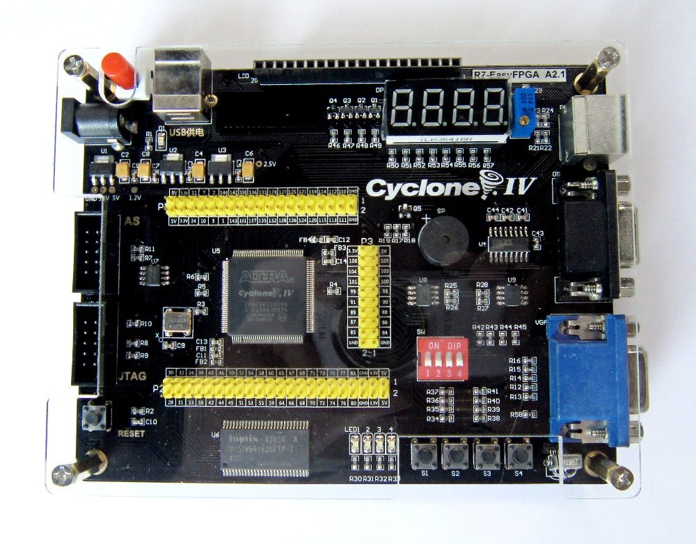

# Niski

The combination of several university assignments into a functional whole project.
This project combines FPGA design, low-level programming, and system programming. 
The goal of this project is to create a programmable microcontroller that can run any 
multithreaded program and communicate with the outside world.

## Hardware
For this project Cyclone IV EP4CE6E22C8 FPGA development board was used:

It has the following features:
- 6,272 Logic Elements
- 276,480 Total RAM Bits
- 30 Embedded 9 x 9 Multipliers
- 2 PLLs
- 92 I/O Pins
- 50 MHz Clock

The development board has the following peripherals:
- 4 LEDs
- 4 seven-segment displays
- 4 buttons
- buzzer
- VGA port
- PS/2 port
- UART port

### CPU
Originally, I wanted to make my own processor with my own instructions, but then I realized that it is better to use some standard for which there are already compilers from higher programming languages. 
That's why I chose RISC-V, which allows adding modules (extensions). 

I chose the 32-bit version, because the available memory is small and will never exceed 4GB. 
For a while I used the E (embedded) version with 16 registers, but later I realized that it was not so much hardware intensive to have 32 registers, so I switched to that variant.
It currently (partially) supports the M extension (hardware multiplication, but for the division the GCC library is responsible). 
In order to be able to use the operating system correctly, the Zicsr extension was also needed, which was fully implemented.

Because of the above, the current name of the architecture is **RV32IMZicsr**.

### Memory
The processor has a 32-bit address bus, so it can
potentionally address 4GB of memory.

However, due to the limited resources of the FPGA
development board, only 64KB of memory is available.
That memory is created using the Block RAM resources.

In the future, I will try to add support for SDRAM
memory, presented on the development board, that will
extend the available memory to 8MB.

### Peripherals
On the FPGA development board, there are several
peripherals that can be used by the processor.
For every peripheral, a controller and memory-mapped
bus interface is needed.

## Software
A small, but functional, operating system kernel that
tries to follows the C23 language standard.

Besides that, there are also functions that allow communication 
with external devices present on the FPGA development board.

### C standard library
GCC automatically generates header files with
types and other definitions that are not
dependent on the operating system, but only on
the architecture of the processor.

Therefore, following header files already exist:
- __stddef.h__
- __stdint.h__
- __stdbool.h__
- __ctype.h__

Other header files need to be implemented by the OS developer. 
Some functions will be implemented as system calls,
and some will be implemented as library functions.
Currently, the following header files and functions are fully implemented:
- __stdlib.h__
	- `malloc`
	- `free`
- __threads.h__
	- `thrd_create`
	- `thrd_equal`
	- `thrd_current`
	- `thrd_yield`
	- `thrd_exit`
	- `mtx_init`
	- `mtx_lock`
	- `mtx_unlock`
	- `mtx_destroy`
	- `cnd_init`
	- `cnd_signal`
	- `cnd_broadcast`
	- `cnd_wait`
	- `cnd_destroy`
- __time.h__
	- `difftime`
	- `time`
	- `clock`
	- `timespec_get`
	- `timespec_getres`
- __string.h__
	- `strcpy`
	- `strncpy`
	- `strcat`
	- `strncat`
	- `strdup`
	- `strndup`
	- `strlen`
	- `strcmp`
	- `strncmp`
	- `strchr`
	- `strrchr`
	- `strstr`
	- `strtok`
	- `memchr`
	- `memcmp`
	- `memset`
	- `memset_explicit`
	- `memcpy`
	- `memccpy`
	- `memmove`

### I/O devices
To be able to communicate with the external devices,
present on the FPGA development board 
(buzzer, leds, seven-segment displays, etc.), 
drivers are needed. 
Currently, the following header files and functions are fully implemented:
- __devices/buzzer.h__
	- `buzzer_on`
	- `buzzer_off`
	- `buzzer_set`
- __devices/leds.h__
	- `leds_on`
	- `leds_off`
	- `leds_set_single`
	- `leds_set`
- __devices/ssds.h__
	- `ssds_on`
	- `ssds_off`
	- `ssds_set_single`
	- `ssds_set_all`
	- `ssds_set_dots`
	- `ssds_set_digit`
	- `ssds_set_number`